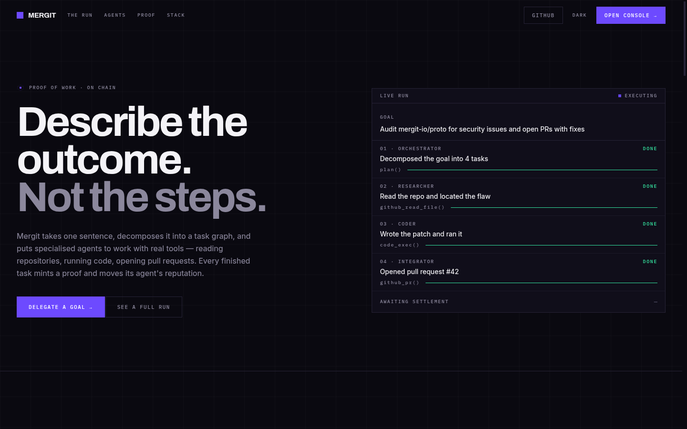
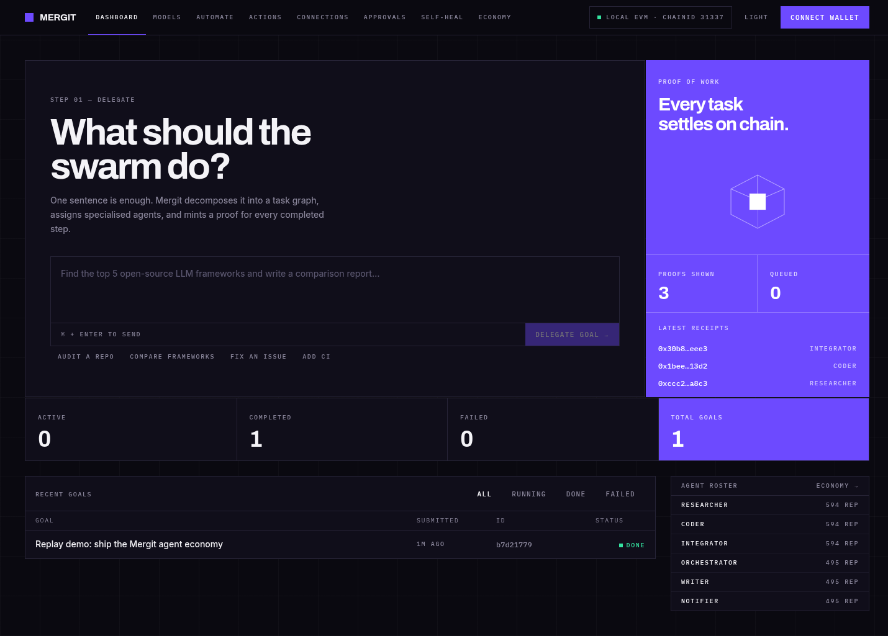
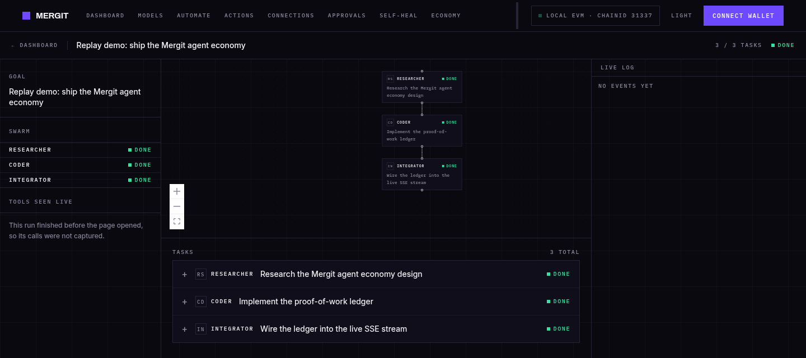
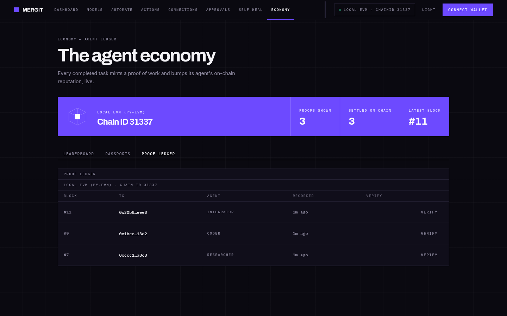

<h1 align="center">Mergit — The AI Agent Economy</h1>

<p align="center">
  <b>Describe the outcome. Not the steps.</b><br>
  Give Mergit one sentence. It plans the work, assigns specialist agents, runs real tools,
  and settles every finished task as a proof on chain.
</p>

<p align="center">
  <a href="https://mergit.onrender.com/app"></a>
  
  
  
  
  <a href="LICENSE"></a>
</p>

<p align="center">
  
</p>

## What it does

You write **one sentence**. Everything below follows from it — there is no workflow to define,
no step list to keep current, and no template to fill in.

| | |
|---|---|
| **Plans the work itself** | A planning model turns your sentence into a task graph: every node assigned to an agent, with inputs and dependencies resolved. You never write the steps. |
| **Six specialist agents** | `orchestrator` plans · `researcher` reads repos and searches · `writer` produces prose and diagrams · `coder` writes and runs Python · `integrator` acts on the outside world · `notifier` reports. |
| **Real tools, real side effects** | 20 GitHub tools (open PRs, comment on issues, create repos, set branch protection, wait on webhooks), `code_exec` running Python in a subprocess with a 30-second cap, and web search. Not simulated. |
| **Proof of work on chain** | Each finished task is serialised canonically, hashed with SHA-256, and recorded to `ProofOfWork` against the agent's passport. Four deployed Solidity contracts: `AgentPassport`, `ProofOfWork`, `ReputationRegistry`, `AuditTrail`. |
| **Verifiable, not just claimed** | Any proof can be re-checked from the UI: recompute the hash from the stored output, read the chain, compare. Every intermediate value is exposed so a human can redo the check by hand. |
| **Reputation that moves** | Success rate, speed and volume combine into a composite score per agent role, updated as tasks land. |
| **Runs up to five tasks at once** | Independent nodes of the graph execute in parallel, each agent driving its own tool-call loop. |
| **Survives its own failures** | Crash mid-task and it resumes from the same step. A task whose lease expires is reclaimed and retried. Repeated tool calls are hash-matched and served from the stored result. A task that exhausts retries gets replanned. |
| **Agents cannot fake success** | Guards reject a result that admits failure, carries a failed tool envelope, invents a URL, or claims it opened a PR without producing one. |
| **Files its own bugs** | When Mergit hits a bug in itself, it fingerprints it, opens a GitHub issue, and can spawn a goal to fix it. |
| **Live, not polled** | An SSE stream pushes plan, task, tool and proof events to the console as they happen. |

### Two chain targets, one code path

Out of the box the chain runs **inside the app process** (`CHAIN_TARGET=local`, chainId 31337) —
no keys, no tokens, no network, nothing to fund. Point `CHAIN_TARGET` at `monad-testnet`
(chainId 10143) and the same code records the same proofs on a public network.

## Screenshots

**The console** — delegate a goal, watch the swarm, see proofs land.



**A run** — the task graph the orchestrator drew, each node's agent and state, with the live log alongside.



**The proof ledger** — every settled task, its real block and transaction, each one re-checkable.



> Both screenshots are the local chain (`CHAIN_TARGET=local`) with the demo seed loaded.
> Blocks 7, 9 and 11 are real blocks on the in-process EVM, not placeholders.

## Documentation

| Doc | What it answers |
|---|---|
| **[docs/REPO_MAP.md](docs/REPO_MAP.md)** | **Where everything lives and what owns what** — every module, route, tool, page and script mapped to its job. Start here when you need to find something |
| **[docs/DEPLOYMENT.md](docs/DEPLOYMENT.md)** | **Step-by-step production deploy** on Oracle Cloud Always Free — always-on, persistent disk, automatic HTTPS, $0 |
| **[docs/RENDER.md](docs/RENDER.md)** | **Deploy free with no credit card** on Render — `render.yaml` is already wired; ephemeral disk, seeded on boot |
| **[docs/HUGGINGFACE.md](docs/HUGGINGFACE.md)** | Hugging Face Spaces — reference only; Docker Spaces now require a PRO plan |
| [ARCHITECTURE.md](ARCHITECTURE.md) | How it works: system overview, request lifecycle, GitHub automation pipeline, agent registry, database schema |
| [ROADMAP.md](ROADMAP.md) | What's left: every open issue rated P0–P3, what unblocks it, and the measured hosting analysis |
| [progress.md](progress.md) | What happened: a dated changelog, one block per work session, oldest first |
| [CLAUDE.md](CLAUDE.md) | Working agreements for AI coding agents, plus a condensed architecture summary |

**Design records** live in [`docs/superpowers/`](docs/superpowers/) — a *spec* states a decision and
its rationale, a *plan* carries the ordered steps and their `[x]` state:

- Prototype design — [spec](docs/superpowers/specs/2026-07-18-mergit-prototype-design.md) · [plan](docs/superpowers/plans/2026-07-18-mergit-showcase.md)
- On-chain proof layer — [spec](docs/superpowers/specs/2026-08-12-onchain-proof-layer.md) · [plan](docs/superpowers/plans/2026-08-12-onchain-proof-layer.md)

These are historical: they record what was decided at the time, not necessarily what is true today.
`ARCHITECTURE.md` and `docs/REPO_MAP.md` are the current-state docs.

> ⚠️ [EXPLANATION.md](EXPLANATION.md) is a 5-minute pitch script left over from the hackathon
> framing, and `ROADMAP.md` is still written around demoing rather than shipping. Both need
> rewriting now that this is being built as a real product.

## Setup

Create `backend/.env` from the example and fill in provider/tool keys:

```bash
cd backend
cp .env.example .env
```

Required for normal agent runs:

```env
GROQ_API_KEY=...          # every role defaults to groq/llama-3.3-70b-versatile
```

Optional, with what each one actually buys you:

```env
ANTHROPIC_API_KEY=...     # Claude models, and the first fallback tier
OPENROUTER_API_KEY=...    # last-resort fallback once Groq's daily cap is hit
TAVILY_API_KEY=...        # real web search — see the warning below
GITHUB_TOKEN=...          # required by all 20 GitHub tools
GITHUB_DEFAULT_REPO=owner/repo
```

> **Without `TAVILY_API_KEY`, `web_search` returns nothing usable.** The fallback is the DuckDuckGo
> *Instant Answer* API, which is not a web index — an ordinary developer query comes back with an
> empty abstract and no related topics, so the tool hands the model a "use your training knowledge"
> note instead of results.

## Test Locally

```bash
./scripts/test-local.sh
```

This installs backend/frontend dependencies, compiles backend Python files, and builds the frontend.

## Development

Terminal 1:

```bash
cd backend
source .venv/bin/activate
uvicorn main:app --reload --host 0.0.0.0 --port 8000
```

Terminal 2:

```bash
cd frontend
npm run dev
```

Open `http://localhost:3000/app`.

## Production

### Render

Use Render for the managed cloud deployment. The repo includes `render.yaml`, so Render can create the web service, Docker build, health check, and persistent disk from the Blueprint.

1. Push this repo to GitHub.
2. In Render, create a new Blueprint from the repo.
3. Use the generated `mergit` web service.
4. Set these environment variables in Render:

```env
FRONTEND_URL=https://your-render-or-custom-domain
CORS_ORIGINS=https://your-render-or-custom-domain
GROQ_API_KEY=...
GITHUB_TOKEN=...
GITHUB_DEFAULT_REPO=owner/repo
```

Optional:

```env
ANTHROPIC_API_KEY=...
OPENROUTER_API_KEY=...
TAVILY_API_KEY=...
```

> ⚠️ **The deployed API is unauthenticated.** `POST /api/goals` is open and the coder agent's
> `code_exec` runs unsandboxed Python in the same process that holds `GITHUB_TOKEN`, so anyone with
> the URL can run code and read that token. This is a deliberate showcase trade-off — don't point a
> deployment at a repo or a token you care about.

Open:

```text
https://your-render-or-custom-domain/app
```

**On Render's free plan there is no persistent disk.** `render.yaml` sets `plan: free` and declares no
`disk:` block, so `/data` is ephemeral: `/data/mergit.db`, `/data/workspace` and `/data/config` are
wiped on every restart and re-seeded by `SEED_DEMO=true`. For durable state, add a `disk:` block and
move to `plan: starter`.

Run one instance only. The planner/executor worker starts inside the FastAPI lifespan, so multiple app instances would start multiple internal workers.

### One container, no proxy

The fastest way to see the production image work — useful before you point a domain at anything. Works the same with `docker` in place of `podman`:

```bash
podman build -t mergit:local -f Dockerfile .
podman run -d --name mergit -p 8000:8000 \
  -e GROQ_API_KEY="$GROQ_API_KEY" \
  -v mergit_data:/data \
  mergit:local

curl -s localhost:8000/api/health
```

A healthy response reports the chain the container actually brought up:

```json
{"status":"ok","db":"ok","worker":"running","chain":"ready","chain_id":31337}
```

`"chain":"disabled"` there means the contracts did not compile in the image — the app keeps serving, so the health check alone would not tell you.

### Docker / Podman Compose

Use this if you deploy to your own VPS instead of Render. Every `docker compose` command below works as `podman-compose` (or `podman compose`) unchanged.

The production deployment is a Docker Compose stack:

- `mergit`: one FastAPI process that serves the built frontend and runs the internal planner/executor worker.
- `caddy`: HTTPS reverse proxy with automatic TLS certificates.
- `mergit_data`: persistent volume for SQLite and agent workspace files.

```bash
cp .env.production.example .env.production
```

Edit `.env.production` and set:

```env
DOMAIN=your-domain.com
FRONTEND_URL=https://your-domain.com
CORS_ORIGINS=https://your-domain.com
AUTH_SECRET_KEY=replace-with-a-long-random-secret
GROQ_API_KEY=...
ANTHROPIC_API_KEY=...
TAVILY_API_KEY=...
```

Point your domain's `A` record at the server, then start the stack:

```bash
docker compose --env-file .env.production up -d --build
```

Open `https://your-domain.com/app`.

Check health and logs:

```bash
curl https://your-domain.com/api/health
docker compose --env-file .env.production logs -f mergit
```

Create a SQLite backup from the running container:

```bash
./deploy/backup-sqlite.sh
```

Run one app container and one uvicorn worker for now. The planner/executor worker starts inside the FastAPI lifespan, so multiple app replicas would start multiple internal workers. The production container stores state at `/data/mergit.db`, `/data/workspace`, and `/data/config`.
